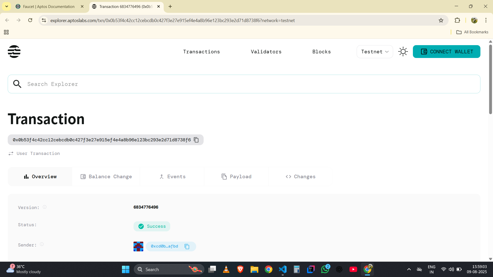

# API Data Oracle

## Project Description

The API Data Oracle smart contract provides a decentralized solution for integrating external API data into the Aptos blockchain ecosystem. This contract enables developers and applications to store, update, and retrieve real-world data from various external sources in a trustless and transparent manner. The oracle acts as a bridge between off-chain data sources and on-chain applications, making external information accessible to smart contracts and dApps.

## Project Vision

Our vision is to create a reliable and efficient data oracle infrastructure that democratizes access to external data on the Aptos blockchain. We aim to build a foundation that enables:

- **Seamless Integration**: Easy connection between external APIs and blockchain applications
- **Data Reliability**: Timestamped and verifiable data entries for enhanced trust
- **Decentralized Access**: Multiple data sources can operate independently while maintaining data integrity
- **Developer-Friendly**: Simple interface for both data providers and consumers

The ultimate goal is to foster a robust ecosystem where real-world data can be efficiently utilized by decentralized applications, enabling more sophisticated and practical blockchain use cases.

## Key Features

### 🔗 **External Data Integration**
- Register and manage multiple API data sources on-chain
- Store external data with proper attribution and source identification
- Maintain data provenance through source URL tracking

### ⏰ **Timestamp Management**
- Automatic timestamping of all data updates
- Track when data was last refreshed for freshness validation
- Enable time-based data validation and expiry logic

### 🔐 **Access Control**
- Owner-only update permissions to prevent unauthorized data manipulation
- Secure data modification through address verification
- Controlled data source management

### 📊 **Data Transparency**
- Public read access to all stored data
- View function for easy data retrieval without gas costs
- Complete data history through blockchain immutability

### 🎯 **Simple API Design**
- Only 2 core functions: register and update data sources
- Clean and intuitive interface for developers
- Minimal complexity while maintaining full functionality

## Future Scope

### 🌐 **Multi-Source Aggregation**
- Implement data aggregation from multiple sources
- Add consensus mechanisms for data validation
- Support for weighted data sources based on reliability

### 📈 **Advanced Data Types**
- Support for complex data structures (JSON, arrays)
- Price feed integration for DeFi applications
- Real-time data streaming capabilities

### 🔄 **Automated Updates**
- Integration with off-chain automation services
- Scheduled data refresh mechanisms
- Event-driven data updates

### 🛡️ **Enhanced Security**
- Multi-signature support for critical data sources
- Data validation and sanitization features
- Reputation system for oracle providers

### 📱 **Developer Tools**
- SDK development for easy integration
- API documentation and examples
- Testing framework for oracle data

### 🌍 **Cross-Chain Compatibility**
- Bridge data between different blockchain networks
- Support for cross-chain data verification
- Interoperability with other oracle networks

## Contract Details

0x0b53f4c42cc12cebcdb0c427f3e27e915ef4e4a8b96e123bc293e2d71d8738f6

